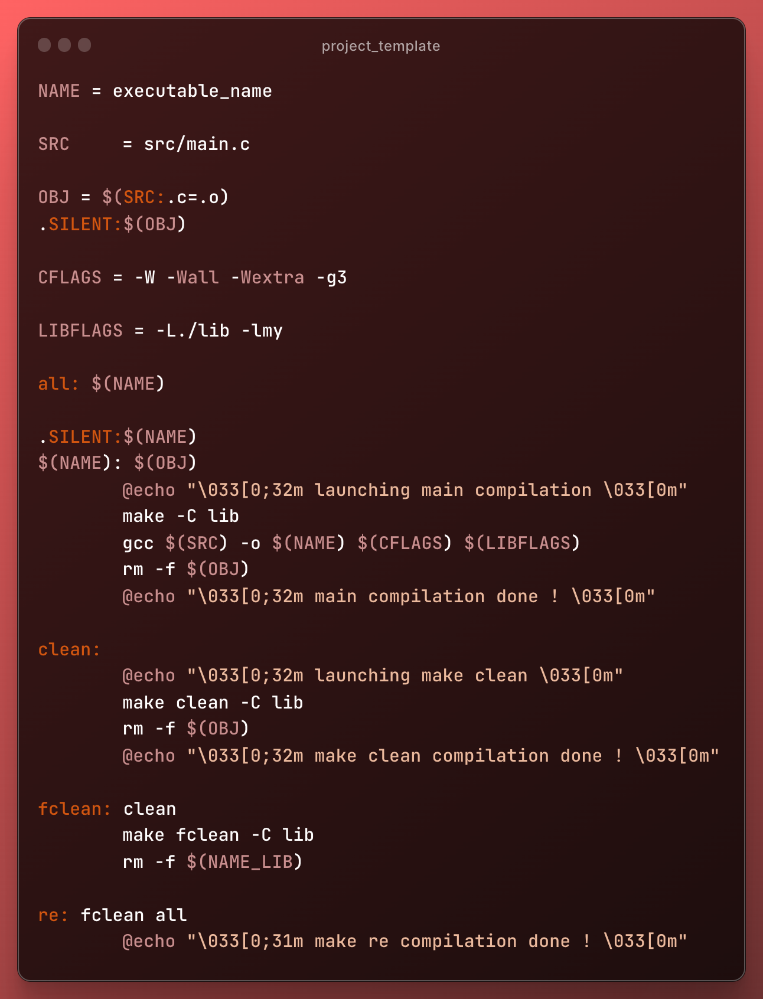

# Mini C library
> EPITECH project template,
> contains a Makefile, basic C lib, includes and project structure i like to use

Project is: _finished_.

Warning: You may get flagged by the EPITECH norminette if you use this, use 
at your own risk !

## Usage
use in a terminal :
(multiple makefile are used, cf mini_lib)

`make` to launch all compilations

`make clean` to compile all and clean all

`make re` to compile all and clean all

## Contact
Created by [@underhoney](https://github.com/underhoney) - feel free to
recommend me music !